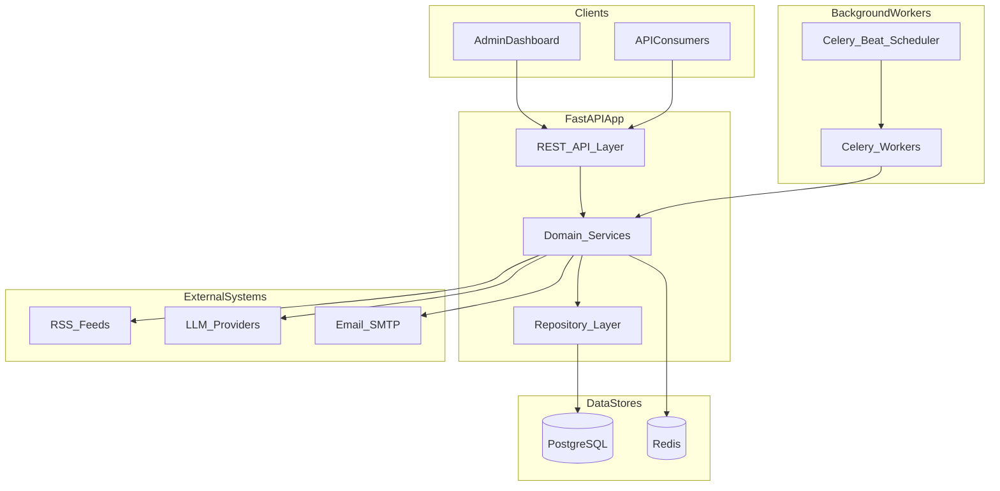
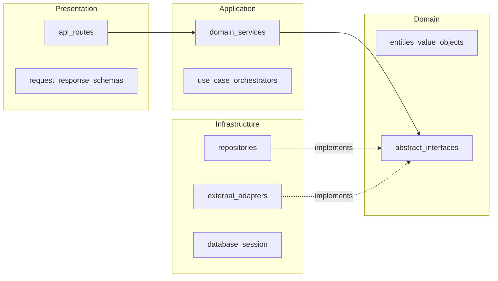
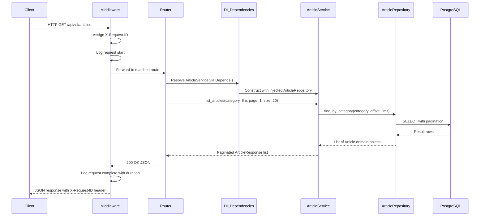
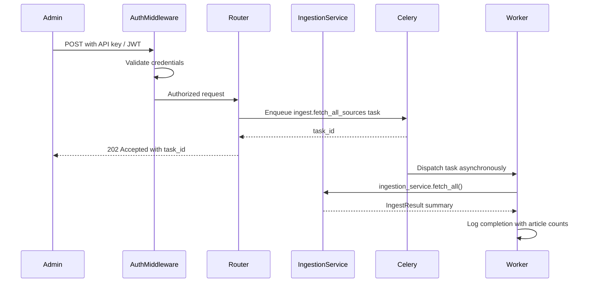
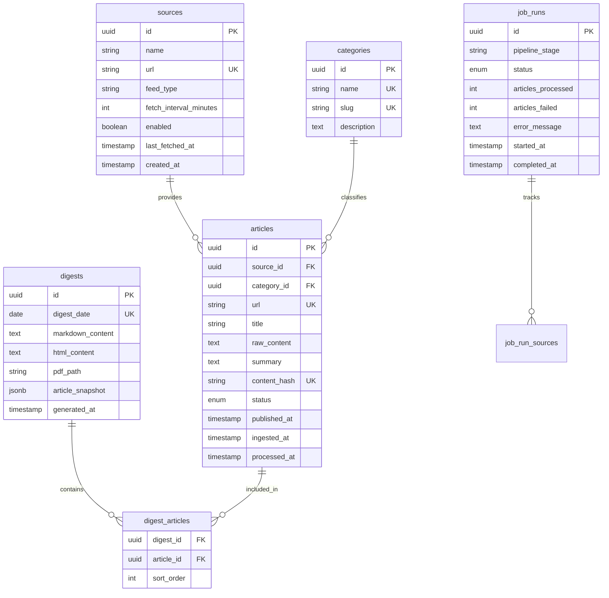
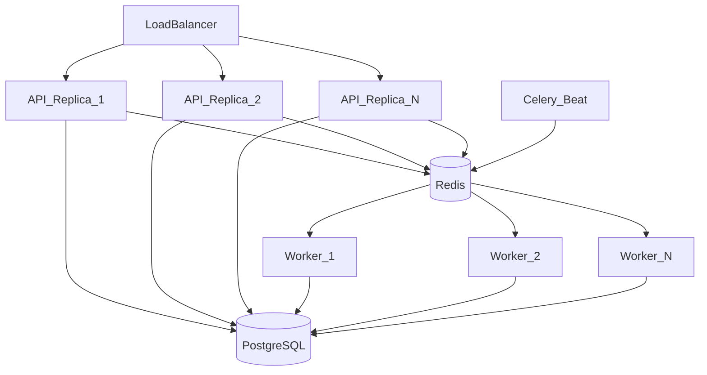

# AI News Digest — Architecture Blueprint

> **Status:** Design document — no implementation code exists yet.
> **Last updated:** 2026-07-30

---

## Table of Contents

1. [Executive Summary](#1-executive-summary)
2. [High-Level Architecture](#2-high-level-architecture)
3. [Folder Structure](#3-folder-structure)
4. [Package Responsibilities](#4-package-responsibilities)
5. [Request Flow](#5-request-flow)
6. [Data Flow](#6-data-flow)
7. [Configuration Strategy](#7-configuration-strategy)
8. [Logging Strategy](#8-logging-strategy)
9. [Error Handling Strategy](#9-error-handling-strategy)
10. [Dependency Injection Strategy](#10-dependency-injection-strategy)
11. [Testing Strategy](#11-testing-strategy)
12. [Security Considerations](#12-security-considerations)
13. [Scalability Considerations](#13-scalability-considerations)
14. [Future Roadmap](#14-future-roadmap)

---

## 1. Executive Summary

### Problem Statement

Staying current with AI news requires monitoring dozens of RSS feeds, blogs, and websites. Manual curation is time-consuming, and raw feeds contain duplicates, varying quality, and overwhelming volume. There is no single, curated, daily summary tailored to AI practitioners.

### Solution

**AI News Digest** is a production-ready platform that:

- Collects AI news from trusted RSS feeds and websites
- Removes duplicate articles through URL and content fingerprinting
- Uses an LLM to summarize and categorize each article
- Stores processed articles in a relational database
- Generates daily digests in Markdown, HTML, and PDF formats
- Exposes REST APIs for programmatic access and an admin dashboard
- Runs fully containerized via Docker

### Architectural Approach

The system is designed as a **modular monolith** in Python 3.12+ with FastAPI. A single deployable unit keeps operational complexity low for a small team while enforcing strict package boundaries that allow future extraction into microservices if load demands it.

### Key Non-Functional Goals

| Goal | Approach |
|------|----------|
| **Reliability** | Idempotent workers, retry with backoff, partial pipeline success |
| **Observability** | Structured JSON logging, correlation IDs, health checks, metrics |
| **Extensibility** | Port/adapter pattern for LLM, RSS, email; plugin-ready source registry |
| **Deployability** | Docker Compose for local and production; CI/CD via GitHub Actions |
| **Testability** | Layered architecture with dependency injection and interface abstractions |

### Technology Stack

| Concern | Choice | Rationale |
|---------|--------|-----------|
| API framework | FastAPI | Async-capable, OpenAPI auto-generation, Pydantic integration |
| Database | PostgreSQL 16 | ACID compliance, JSON support, mature ecosystem |
| ORM / Migrations | SQLAlchemy 2.x + Alembic | Industry standard for Python data access |
| Task queue | Celery + Redis | Reliable scheduled and background job processing |
| LLM integration | Provider-agnostic adapter | OpenAI, Anthropic, or local models via configuration |
| Caching | Redis | Dedup fingerprints, rate limiting, optional response cache |
| Containerization | Docker + Compose | Explicit project requirement |
| CI/CD | GitHub Actions | Lint, type-check, test, build, deploy hooks |

---

## 2. High-Level Architecture

### Runtime Processes

The deployed system consists of three cooperating processes:

| Process | Role |
|---------|------|
| **API Server** (Uvicorn) | Serves REST endpoints, handles synchronous read/write requests |
| **Celery Workers** | Executes background tasks: RSS fetch, LLM processing, digest generation, email delivery |
| **Celery Beat** | Schedules recurring jobs (e.g., daily ingest at 06:00 UTC, digest at 08:00 UTC) |

All processes share the same codebase and connect to PostgreSQL and Redis.

### System Context Diagram



### Internal Layer Model

The monolith follows a **ports-and-adapters (hexagonal)** layering:



### Layer Boundary Rules

| Rule | Description |
|------|-------------|
| **Inward dependencies only** | Outer layers depend on inner layers; domain never imports infrastructure |
| **No direct DB access from API** | Routes delegate to services; services delegate to repositories via port interfaces |
| **No business logic in routes** | Routes validate input, call a service, map output to response schemas |
| **Infrastructure is swappable** | LLM provider, email sender, and RSS fetcher are behind abstract ports |
| **Workers reuse services** | Celery tasks are thin wrappers that invoke the same service layer as the API |

---

## 3. Folder Structure

```
ai-news-digest/
├── src/
│   └── ai_news_digest/
│       ├── main.py                      # FastAPI application factory
│       ├── api/                         # HTTP presentation layer
│       │   ├── v1/
│       │   │   ├── routes/
│       │   │   │   ├── articles.py
│       │   │   │   ├── digests.py
│       │   │   │   ├── sources.py
│       │   │   │   ├── categories.py
│       │   │   │   ├── admin.py
│       │   │   │   └── health.py
│       │   │   ├── schemas/             # Pydantic request/response models
│       │   │   └── dependencies/        # FastAPI Depends() wiring
│       │   └── middleware/
│       │       ├── request_id.py
│       │       ├── logging.py
│       │       └── rate_limit.py
│       ├── core/                        # Cross-cutting concerns
│       │   ├── config.py                # Pydantic Settings
│       │   ├── logging.py               # structlog configuration
│       │   ├── exceptions.py            # Exception hierarchy
│       │   └── di.py                    # Dependency injection factories
│       ├── domain/                      # Pure domain logic (no I/O)
│       │   ├── models/                  # Entities and value objects
│       │   │   ├── article.py
│       │   │   ├── digest.py
│       │   │   ├── source.py
│       │   │   └── category.py
│       │   ├── enums/
│       │   │   ├── article_status.py
│       │   │   └── digest_format.py
│       │   └── ports/                   # Abstract interfaces (Protocols)
│       │       ├── article_repository.py
│       │       ├── source_repository.py
│       │       ├── digest_repository.py
│       │       ├── rss_fetcher.py
│       │       ├── llm_client.py
│       │       ├── email_sender.py
│       │       └── cache_store.py
│       ├── services/                    # Application / use-case layer
│       │   ├── ingestion/
│       │   │   └── ingestion_service.py
│       │   ├── deduplication/
│       │   │   └── deduplication_service.py
│       │   ├── summarization/
│       │   │   └── summarization_service.py
│       │   ├── categorization/
│       │   │   └── categorization_service.py
│       │   ├── digest/
│       │   │   └── digest_service.py
│       │   └── delivery/
│       │       └── delivery_service.py
│       ├── infrastructure/            # Concrete adapter implementations
│       │   ├── database/
│       │   │   ├── session.py           # Engine, session factory
│       │   │   ├── models/              # SQLAlchemy ORM models
│       │   │   ├── repositories/        # Port implementations
│       │   │   └── migrations/          # Alembic migration scripts
│       │   ├── rss/
│       │   │   └── feedparser_fetcher.py
│       │   ├── llm/
│       │   │   ├── openai_client.py
│       │   │   ├── anthropic_client.py
│       │   │   └── factory.py           # Provider selection
│       │   ├── email/
│       │   │   └── smtp_sender.py
│       │   └── cache/
│       │       └── redis_store.py
│       ├── workers/                     # Celery tasks and beat schedule
│       │   ├── celery_app.py
│       │   ├── tasks/
│       │   │   ├── ingest.py
│       │   │   ├── process.py
│       │   │   ├── digest.py
│       │   │   └── deliver.py
│       │   └── beat_schedule.py
│       └── templates/                   # Digest rendering templates
│           ├── digest.html.j2
│           ├── digest.md.j2
│           └── digest.css
├── tests/
│   ├── unit/
│   │   ├── domain/
│   │   └── services/
│   ├── integration/
│   │   ├── repositories/
│   │   └── workers/
│   ├── e2e/
│   │   └── test_pipeline.py
│   ├── fixtures/
│   │   ├── rss_feeds/
│   │   └── llm_responses/
│   └── conftest.py
├── docker/
│   ├── Dockerfile                       # API server image
│   ├── Dockerfile.worker                # Celery worker image
│   └── docker-compose.yml               # Full stack: API, worker, beat, PG, Redis
├── scripts/
│   ├── seed_sources.py                  # Populate default RSS sources
│   └── run_migrations.sh
├── docs/
│   ├── ARCHITECTURE.md                  # This document
│   └── PROJECT_STATUS.md
├── .github/
│   └── workflows/
│       ├── ci.yml                       # Lint, type-check, test
│       └── deploy.yml                   # Build and push Docker images
├── .env.example                         # Template for local environment variables
├── pyproject.toml                       # Project metadata, dependencies, tool config
├── alembic.ini
└── README.md
```

### Naming Conventions

| Context | Convention | Example |
|---------|------------|---------|
| Python modules | `snake_case` | `ingestion_service.py` |
| Python classes | `PascalCase` | `IngestionService` |
| Python constants | `UPPER_SNAKE_CASE` | `MAX_RETRY_ATTEMPTS` |
| Python functions/methods | `snake_case` | `fetch_articles()` |
| API route prefix | `/api/v1/` | `/api/v1/articles` |
| API route segments | `kebab-case` | `/api/v1/job-runs` |
| Environment variables | `UPPER_SNAKE_CASE` | `DATABASE_URL` |
| Database tables | `snake_case`, plural | `articles`, `job_runs` |
| Database columns | `snake_case` | `content_hash`, `published_at` |
| Celery task names | dotted namespace | `workers.tasks.ingest.fetch_all_sources` |

---

## 4. Package Responsibilities

### Top-Level Package Map

| Package | Single Responsibility | May Import From | Must NOT Import |
|---------|----------------------|-----------------|-----------------|
| `api/` | HTTP routing, request validation, response serialization, middleware | `core`, `services`, `domain` (schemas only) | `infrastructure` directly |
| `core/` | Configuration, logging, exceptions, DI wiring | Standard library, third-party libs | `api`, `services`, `infrastructure` |
| `domain/` | Entities, value objects, enums, port interfaces | Standard library only | Everything else in the project |
| `services/` | Use-case orchestration and business rules | `domain`, `core` | `api`, `infrastructure` (concrete) |
| `infrastructure/` | Database, RSS, LLM, email, cache implementations | `domain`, `core` | `api`, `services` |
| `workers/` | Celery task definitions and beat schedule | `core`, `services`, `domain` | `api` |
| `templates/` | Jinja2 templates for digest rendering | N/A (static assets) | Application code |

### Detailed Package Descriptions

#### `api/` — Presentation Layer

- Defines all REST endpoints grouped by resource under `api/v1/routes/`
- Validates incoming requests and serializes responses using Pydantic schemas in `api/v1/schemas/`
- Applies middleware: request ID assignment, structured request/response logging, rate limiting
- Registers global exception handlers that map domain exceptions to HTTP status codes
- Generates OpenAPI documentation automatically via FastAPI
- Does **not** contain business logic or database queries

#### `core/` — Cross-Cutting Concerns

- **`config.py`** — Loads and validates all settings from environment variables via Pydantic Settings
- **`logging.py`** — Configures structlog with JSON output (production) or console output (development)
- **`exceptions.py`** — Defines the application exception hierarchy
- **`di.py`** — Factory functions that wire port interfaces to concrete infrastructure implementations; consumed by FastAPI `Depends()` and worker task bootstrapping

#### `domain/` — Domain Layer

- **`models/`** — Pure Python dataclasses or Pydantic models representing business entities: `Article`, `Digest`, `Source`, `Category`
- **`enums/`** — Domain enumerations: `ArticleStatus` (raw, summarized, categorized, published), `DigestFormat` (markdown, html, pdf)
- **`ports/`** — Abstract base classes or `typing.Protocol` definitions for every external dependency:
  - `ArticleRepository` — CRUD and query operations on articles
  - `SourceRepository` — Manage RSS source configuration
  - `DigestRepository` — Store and retrieve generated digests
  - `RSSFetcher` — Fetch and parse RSS/Atom feeds
  - `LLMClient` — Summarize and categorize text
  - `EmailSender` — Send digest emails
  - `CacheStore` — Key-value cache for dedup fingerprints and rate limits

#### `services/` — Application Layer

Each service encapsulates one use case and coordinates domain models with port interfaces:

| Service | Responsibility |
|---------|---------------|
| `IngestionService` | Orchestrates RSS fetch across all enabled sources, parses entries, normalizes URLs and timestamps |
| `DeduplicationService` | Computes content hashes, checks against dedup index, filters duplicate articles |
| `SummarizationService` | Sends article content to LLM for concise summary generation |
| `CategorizationService` | Sends article title and summary to LLM for category assignment |
| `DigestService` | Aggregates categorized articles for a date range, renders Markdown/HTML/PDF |
| `DeliveryService` | Sends generated digest via email to configured recipients |

Services accept port interfaces via constructor injection. They contain the business rules (e.g., "skip articles older than 7 days", "limit digest to top 20 articles per category").

#### `infrastructure/` — Infrastructure Layer

Concrete implementations of all domain ports:

| Submodule | Responsibility |
|-----------|---------------|
| `database/session.py` | SQLAlchemy engine creation, session factory, connection pooling |
| `database/models/` | SQLAlchemy ORM table definitions mapping to PostgreSQL |
| `database/repositories/` | Implementations of repository ports using SQLAlchemy sessions |
| `database/migrations/` | Alembic version-controlled schema migrations |
| `rss/feedparser_fetcher.py` | HTTP fetch + feedparser parsing with timeout and user-agent |
| `llm/openai_client.py` | OpenAI API adapter implementing `LLMClient` |
| `llm/anthropic_client.py` | Anthropic API adapter implementing `LLMClient` |
| `llm/factory.py` | Selects LLM adapter based on `LLM_PROVIDER` config |
| `email/smtp_sender.py` | SMTP email delivery with HTML body and PDF attachment |
| `cache/redis_store.py` | Redis-backed implementation of `CacheStore` |

#### `workers/` — Background Processing

- **`celery_app.py`** — Celery application instance configured with Redis broker and result backend
- **`tasks/`** — Thin task functions that bootstrap dependencies and delegate to services:
  - `ingest.fetch_all_sources` — Triggers `IngestionService` for all enabled sources
  - `process.summarize_and_categorize` — Runs LLM pipeline on unprocessed articles
  - `digest.generate_daily` — Creates daily digest in all formats
  - `deliver.send_digest_email` — Sends latest digest to subscribers
- **`beat_schedule.py`** — Cron-style schedule definitions for automated daily pipeline

#### `templates/` — Rendering Assets

- Jinja2 HTML template for digest email and web preview
- Jinja2 Markdown template for plain-text digest
- CSS stylesheet referenced by HTML template
- PDF generated from rendered HTML via a headless renderer (e.g., WeasyPrint)

---

## 5. Request Flow

### Standard Read Request

Example: `GET /api/v1/articles?category=llm&page=1&size=20`



### Admin Write Request

Example: `POST /api/v1/admin/ingest/trigger`



### Error Propagation

When an error occurs at any layer:

1. **Service layer** raises a typed exception (e.g., `NotFoundError`, `LLMError`)
2. **Exception propagates** up through the route (not caught in the route itself)
3. **Global exception handler** in `api/` catches the exception
4. **Handler maps** exception type to HTTP status code and standardized JSON error envelope
5. **Middleware logs** the error with request ID, exception type, and stack trace (ERROR level)
6. **Client receives** `{ "error": { "code": "NOT_FOUND", "message": "...", "request_id": "..." } }`

| Exception | HTTP Status |
|-----------|-------------|
| `NotFoundError` | 404 |
| `ValidationError` | 422 |
| `DuplicateArticleError` | 409 |
| `ExternalServiceError` | 502 |
| `LLMError` | 503 |
| `ConfigurationError` | 500 |
| Unhandled | 500 |

---

## 6. Data Flow

### Daily Pipeline (Batch Processing)

The primary data flow runs as a scheduled Celery Beat pipeline:

```mermaid
flowchart LR
    A[RSS_Fetch] --> B[Parse_Normalize]
    B --> C[Deduplicate]
    C --> D[Persist_Raw]
    D --> E[LLM_Summarize]
    E --> F[LLM_Categorize]
    F --> G[Update_Article]
    G --> H[Generate_Digest]
    H --> I[Render_MD_HTML_PDF]
    I --> J[Store_Digest]
    J --> K[Email_Delivery]
```



### Pipeline Stage Details

| Stage | Input | Output | Failure Behavior |
|-------|-------|--------|-----------------|
| **RSS Fetch** | Source URLs from `sources` table | Raw feed entries | Log error, skip failed source, continue with others |
| **Parse & Normalize** | Raw XML/JSON feed data | Normalized article dicts (title, url, content, published_at) | Skip malformed entries |
| **Deduplicate** | Normalized articles + dedup index | New articles only | N/A (filter step) |
| **Persist Raw** | New articles | Rows in `articles` table with status `raw` | Transaction rollback on DB error |
| **LLM Summarize** | Article raw content | Summary text | Retry 3x with backoff; mark article `failed` on permanent failure |
| **LLM Categorize** | Title + summary | Category assignment | Retry 3x; default to `uncategorized` on failure |
| **Update Article** | Summary + category | Updated article row, status `categorized` | Transaction rollback |
| **Generate Digest** | Categorized articles for date | Digest content object | Fail pipeline stage, alert via logs |
| **Render** | Digest content | Markdown, HTML, PDF files | Fail if any required format fails |
| **Store Digest** | Rendered files | Row in `digests` table | Transaction rollback |
| **Email Delivery** | Digest HTML + PDF | Email sent confirmation | Retry 3x; log failure, digest still available via API |

### Entity-Relationship Model



### Deduplication Strategy

Deduplication operates at two levels:

1. **Exact dedup (Phase 1):**
   - Normalize URL: lowercase, strip trailing slashes, remove UTM parameters
   - Compute SHA-256 hash of normalized article body text
   - Check both normalized URL and content hash against `articles` table and Redis cache
   - Reject if either match exists

2. **Fuzzy dedup (Phase 2 — future enhancement):**
   - Compute SimHash of article title
   - Flag near-duplicates with Hamming distance below threshold
   - Queue for manual review or automatic merge

### Data Lifecycle

```
RSS Feed → raw article → summarized → categorized → published in digest → archived
```

- Articles older than a configurable retention period (default: 90 days) are soft-deleted or moved to an archive table
- Digests are retained indefinitely
- Job run audit records are retained for 30 days

---

## 7. Configuration Strategy

### Principles

- **Environment variables are the single source of truth** for all runtime configuration
- **Pydantic Settings** validates types and required fields at application startup
- **Fail fast** in production: missing required secrets prevent the application from starting
- **No secrets in source code or version control** — `.env` files are gitignored; `.env.example` documents required variables

### Settings Groups

Settings are organized into logical groups, each as a Pydantic Settings class:

| Settings Class | Responsibility | Key Variables |
|---------------|---------------|---------------|
| `AppSettings` | Application metadata, environment, debug mode | `APP_NAME`, `ENVIRONMENT`, `DEBUG`, `LOG_LEVEL` |
| `DatabaseSettings` | PostgreSQL connection | `DATABASE_URL`, `DB_POOL_SIZE`, `DB_MAX_OVERFLOW` |
| `RedisSettings` | Redis connection | `REDIS_URL`, `REDIS_DEDUP_TTL_SECONDS` |
| `LLMSettings` | LLM provider configuration | `LLM_PROVIDER`, `LLM_API_KEY`, `LLM_MODEL`, `LLM_MAX_TOKENS`, `LLM_TEMPERATURE` |
| `EmailSettings` | SMTP delivery | `SMTP_HOST`, `SMTP_PORT`, `SMTP_USER`, `SMTP_PASSWORD`, `EMAIL_FROM`, `EMAIL_RECIPIENTS` |
| `SchedulerSettings` | Pipeline timing | `INGEST_CRON`, `DIGEST_CRON`, `DIGEST_TIMEZONE` |
| `SecuritySettings` | Auth and CORS | `API_KEY`, `JWT_SECRET`, `CORS_ORIGINS`, `RATE_LIMIT_PER_MINUTE` |

### Environment Profiles

| Profile | `ENVIRONMENT` value | Behavior |
|---------|-------------------|----------|
| **Development** | `development` | Debug logging, hot reload, `.env` file loaded, relaxed auth |
| **Staging** | `staging` | JSON logging, full auth, mirrors production config |
| **Production** | `production` | JSON logging, strict validation, no debug endpoints, required secrets enforced |

### Feature Flags

Optional capabilities controlled via boolean environment variables:

| Flag | Default | Purpose |
|------|---------|---------|
| `FEATURE_PDF_GENERATION` | `true` | Enable/disable PDF digest rendering |
| `FEATURE_EMAIL_DELIVERY` | `true` | Enable/disable email sending |
| `FEATURE_FUZZY_DEDUP` | `false` | Enable SimHash near-duplicate detection |
| `FEATURE_ADMIN_API` | `true` | Enable admin endpoints |

### Configuration Loading Order

1. Default values defined in Pydantic Settings classes
2. Environment variables (override defaults)
3. `.env` file (development only, override env vars)
4. Docker secrets mounted as files (production, for sensitive values like `LLM_API_KEY`)

---

## 8. Logging Strategy

### Goals

- Every log entry is **structured**, **searchable**, and **correlatable**
- Production logs are JSON; development logs are human-readable
- Sensitive data never appears in logs

### Implementation

| Aspect | Approach |
|--------|----------|
| **Library** | `structlog` with stdlib integration |
| **Format (prod)** | JSON with timestamp, level, logger, message, context fields |
| **Format (dev)** | Colored console output with key=value pairs |
| **Correlation ID** | `X-Request-ID` header assigned by middleware; propagated to all log entries within a request |
| **Worker correlation** | Celery task ID used as correlation ID in worker logs |

### Standard Context Fields

Every log entry includes:

| Field | Source | Example |
|-------|--------|---------|
| `timestamp` | Auto | `2026-07-30T06:00:00Z` |
| `level` | Auto | `INFO` |
| `logger` | Auto | `services.ingestion` |
| `request_id` | Middleware / task | `a1b2c3d4-e5f6-7890` |
| `environment` | Config | `production` |

Additional context fields are added per operation:

| Operation | Extra Fields |
|-----------|-------------|
| RSS ingest | `source_id`, `source_name`, `articles_fetched`, `articles_new`, `duration_ms` |
| LLM call | `provider`, `model`, `tokens_input`, `tokens_output`, `duration_ms` |
| Digest generation | `digest_date`, `article_count`, `formats_generated` |
| Email delivery | `recipient_count`, `success`, `duration_ms` |
| API request | `method`, `path`, `status_code`, `duration_ms` |

### Log Levels

| Level | Usage |
|-------|-------|
| `DEBUG` | Development only — query details, parsed feed entries (truncated) |
| `INFO` | Normal operations — pipeline start/complete, article counts, API requests |
| `WARNING` | Retries, degraded behavior — feed timeout (will retry), LLM rate limit hit |
| `ERROR` | Failures requiring attention — permanent feed failure, LLM error after retries, email send failure |
| `CRITICAL` | System-level failures — database unreachable, Redis unreachable, config validation failure |

### Sensitive Data Policy

- **Never log:** API keys, passwords, SMTP credentials, full JWT tokens
- **Truncate:** Article body content in DEBUG logs (first 200 characters only)
- **Redact:** Email addresses in INFO logs (show domain only)

---

## 9. Error Handling Strategy

### Exception Hierarchy

All application exceptions inherit from a base `AppError`:

```
AppError (base)
├── NotFoundError              # Resource does not exist
├── ValidationError              # Business rule violation
├── DuplicateArticleError        # Article already exists
├── ExternalServiceError         # RSS, SMTP, or other external failure
│   └── LLMError                 # LLM-specific failure (rate limit, timeout, bad response)
├── ConfigurationError           # Invalid or missing configuration
└── PipelineError                # Batch pipeline stage failure
    ├── IngestionError
    ├── SummarizationError
    └── DigestGenerationError
```

Each exception carries:

- `code` — Machine-readable error code (e.g., `ARTICLE_NOT_FOUND`)
- `message` — Human-readable description
- `details` — Optional dict with additional context

### API Error Response Envelope

All error responses follow a consistent JSON structure:

```json
{
  "error": {
    "code": "ARTICLE_NOT_FOUND",
    "message": "Article with id 'abc-123' was not found.",
    "request_id": "a1b2c3d4-e5f6-7890"
  }
}
```

### Retry Strategy

External service calls use exponential backoff with jitter:

| Service | Max Retries | Initial Delay | Max Delay | Retry On |
|---------|-------------|---------------|-----------|----------|
| RSS fetch | 3 | 2s | 30s | Timeout, 5xx, connection error |
| LLM API | 3 | 5s | 60s | Rate limit (429), timeout, 5xx |
| SMTP send | 3 | 10s | 120s | Connection error, temporary rejection |
| Database | 2 | 1s | 5s | Connection error, deadlock |

### Circuit Breaker (LLM)

When the LLM provider fails repeatedly:

1. After 5 consecutive failures within 10 minutes, the circuit **opens**
2. While open, new summarization/categorization requests fail fast with `LLMError`
3. After a 5-minute cooldown, one probe request is allowed (half-open state)
4. On probe success, circuit **closes** and normal operation resumes

### Worker Error Handling

- Tasks are **idempotent** — safe to retry without side effects
- Failed tasks log at ERROR with full context and exception traceback
- Permanent failures (after all retries exhausted) are logged at ERROR with a `dead_letter` flag
- Pipeline stages are **independent** — ingestion failure does not block digest generation from existing articles
- Each pipeline run creates a `job_runs` audit record with status, counts, and error messages

### Partial Success

The daily pipeline supports partial success:

- If 3 of 5 RSS sources fail, the 2 successful sources are still processed
- If 2 of 50 articles fail LLM processing, the remaining 48 are summarized and included in the digest
- The `job_runs` record captures `articles_processed` and `articles_failed` counts

---

## 10. Dependency Injection Strategy

### Principles

- Dependencies flow through **constructor injection** or **FastAPI `Depends()`**
- Services depend on **port interfaces**, never concrete implementations
- Wiring happens in one place: `core/di.py`
- No global singletons or module-level mutable state

### API Layer (Request-Scoped)

FastAPI's dependency injection system manages request-scoped lifetimes:

| Dependency | Scope | Provided By |
|-----------|-------|-------------|
| `DBSession` | Per-request | `get_db_session()` — opens session, yields, closes on completion |
| `ArticleRepository` | Per-request | `get_article_repository(session)` |
| `ArticleService` | Per-request | `get_article_service(repo)` |
| `Settings` | Application | `get_settings()` — cached via `@lru_cache` |

Route handlers declare dependencies via type annotations and `Depends()`:

```
Route handler → Depends(get_article_service) → Depends(get_article_repository) → Depends(get_db_session)
```

### Worker Layer (Task-Scoped)

Celery tasks bootstrap their own dependencies since they run outside the FastAPI request lifecycle:

1. Task function is invoked by Celery
2. Task calls a factory function from `core/di.py` to create a dependency graph
3. Factory creates DB session, repositories, and services
4. Task delegates to the service method
5. Factory cleans up (closes DB session) in a `finally` block

### Wiring in `core/di.py`

The DI module contains factory functions that map ports to concrete implementations based on configuration:

| Factory Function | Returns | Implementation Selected By |
|-----------------|---------|---------------------------|
| `create_article_repository(session)` | `ArticleRepository` | Always SQLAlchemy |
| `create_rss_fetcher()` | `RSSFetcher` | Always Feedparser-based |
| `create_llm_client()` | `LLMClient` | `LLM_PROVIDER` config (openai, anthropic) |
| `create_email_sender()` | `EmailSender` | Always SMTP |
| `create_cache_store()` | `CacheStore` | Always Redis |
| `create_ingestion_service(...)` | `IngestionService` | Composes above dependencies |

### Testing Overrides

In tests, dependencies are replaced without modifying production code:

| Test Type | Override Mechanism |
|-----------|-------------------|
| API tests | `app.dependency_overrides[get_article_service] = lambda: mock_service` |
| Service unit tests | Pass mock repositories directly to service constructor |
| Worker tests | Celery `task_always_eager=True` + mock factories |
| Integration tests | Real PostgreSQL/Redis via testcontainers |

### Design Decision: No DI Framework

A full DI container (e.g., `dependency-injector`) is intentionally avoided. FastAPI's built-in `Depends()` plus explicit factory functions in `core/di.py` provide sufficient wiring for a modular monolith. A DI framework may be reconsidered if the number of services and adapters grows significantly.

---

## 11. Testing Strategy

### Testing Pyramid

```
        ╱╲
       ╱  ╲        E2E (few)
      ╱────╲       Full pipeline with mocked externals
     ╱      ╲
    ╱────────╲     Integration (some)
   ╱          ╲    Repositories, migrations, workers
  ╱────────────╲
 ╱              ╲   Unit (many)
╱────────────────╲ Domain logic, services, dedup, formatting
```

### Test Layers

| Layer | Tooling | Scope | I/O |
|-------|---------|-------|-----|
| **Unit** | pytest | Domain models, dedup hashing, digest formatting, service logic with mocked ports | None |
| **Integration** | pytest + testcontainers | Repository CRUD, Alembic migrations, Redis cache operations | Real Postgres + Redis in containers |
| **API** | pytest + httpx `AsyncClient` | Route contracts, auth enforcement, error response shapes, pagination | ASGI app with test DB |
| **Workers** | pytest + Celery eager mode | Task dispatch, service delegation, error handling | Mocked externals |
| **E2E** | pytest | Full daily pipeline: ingest → dedup → summarize → digest → store | Mocked LLM + real DB |
| **LLM** | VCR cassettes / JSON fixtures | Recorded LLM responses replayed in tests | None (no live API calls) |

### Test Organization

Tests mirror the source package structure:

```
tests/
├── unit/
│   ├── domain/          # Entity validation, enum behavior
│   └── services/        # Service logic with mocked ports
├── integration/
│   ├── repositories/    # CRUD against real Postgres
│   └── workers/           # Task execution with eager Celery
├── e2e/
│   └── test_pipeline.py # End-to-end pipeline test
├── fixtures/
│   ├── rss_feeds/       # Sample RSS XML files
│   └── llm_responses/   # Recorded LLM API responses
└── conftest.py          # Shared fixtures: test DB, mock repos, app client
```

### Key Testing Principles

- **No live external calls in CI** — RSS, LLM, and SMTP are always mocked or replayed from fixtures
- **Testcontainers for integration tests** — Spin up real PostgreSQL and Redis per test session
- **Factory fixtures** — Use factory functions (not static fixtures) to create test articles, sources, and digests with sensible defaults
- **Isolation** — Each test runs in a transaction that is rolled back after completion
- **Deterministic** — No time-dependent assertions; freeze time with `freezegun` where needed

### Coverage Targets

| Package | Minimum Coverage |
|---------|-----------------|
| `domain/` | 90% |
| `services/` | 85% |
| `api/` | 80% |
| `infrastructure/` | 75% |
| `workers/` | 80% |
| **Overall** | **80%** |

### CI Quality Gates

Every pull request must pass:

1. **Lint** — `ruff check` (no violations)
2. **Format** — `ruff format --check` (no diff)
3. **Type check** — `mypy` (no errors in strict mode)
4. **Unit + integration tests** — `pytest` (all pass, coverage threshold met)
5. **Security scan** — `pip-audit` (no known vulnerabilities in dependencies)

---

## 12. Security Considerations

### Authentication and Authorization

| Endpoint Class | Auth Method | Access |
|---------------|-------------|--------|
| Public read (articles, digests) | None or optional API key | Anyone |
| Admin write (trigger ingest, manage sources) | API key or JWT | Authenticated admins only |
| Health/metrics | None | Internal network only (not exposed publicly) |

- API keys are stored as hashed values; plain keys are shown only once at creation
- JWT tokens expire after a configurable duration (default: 24 hours)
- Admin endpoints require explicit authorization checks, not just authentication

### Input Validation

- All API inputs validated via Pydantic schemas before reaching services
- URL fields validated for scheme (http/https only) to prevent SSRF
- RSS source URLs are admin-configured only — never accepted from unauthenticated users
- HTML content sanitized before rendering in digest templates (bleach or equivalent)
- SQL injection prevented by parameterized queries via SQLAlchemy ORM

### Secrets Management

| Secret | Storage | Access |
|--------|---------|--------|
| `DATABASE_URL` | Environment variable / Docker secret | API, workers |
| `LLM_API_KEY` | Environment variable / Docker secret | Workers only |
| `SMTP_PASSWORD` | Environment variable / Docker secret | Workers only |
| `JWT_SECRET` | Environment variable / Docker secret | API only |
| `API_KEY` (admin) | Hashed in database | API validation |

- `.env` files are in `.gitignore`
- `.env.example` documents required variables with placeholder values
- Docker Compose uses `secrets` for production deployments
- Secrets are never logged, included in error messages, or exposed via API responses

### Network Security

- CORS restricted to known admin dashboard origin(s)
- Rate limiting on public API endpoints (Redis-backed, configurable per minute)
- Database and Redis not exposed outside the Docker network
- API server is the only service with an external port mapping
- HTTPS enforced in production via reverse proxy (nginx/Traefik)

### LLM Security

- RSS feed content is treated as **untrusted input**
- Article content is truncated before sending to LLM to limit token usage and injection surface
- LLM system prompts are static templates — user input is never interpolated into system prompts
- LLM responses are validated (expected format, length limits) before storage

### Dependency Security

- Dependabot or Renovate configured for automated dependency update PRs
- `pip-audit` runs in CI to detect known vulnerabilities
- Docker base images pinned to specific digests, updated regularly
- Minimum dependency policy — only add packages with active maintenance

### Data Protection

- Database user has minimum required privileges (no superuser)
- Article content may contain links to external sites — rendered with `rel="noopener noreferrer"`
- No personal user data collected in Phase 1 (no user accounts)
- GDPR consideration for future: email addresses stored with consent, deletable on request

---

## 13. Scalability Considerations

### Current Architecture Limits (Modular Monolith)

The modular monolith comfortably handles:

- **Sources:** Up to 100 RSS feeds
- **Articles:** Up to 10,000 articles per day
- **API traffic:** Up to 1,000 requests per minute
- **Digest subscribers:** Up to 1,000 email recipients
- **LLM calls:** Bounded by provider rate limits (mitigated by batching and queuing)

### Near-Term Scaling (Within Monolith)

| Bottleneck | Mitigation |
|-----------|------------|
| API throughput | Horizontal scaling — run multiple Uvicorn replicas behind a load balancer (stateless) |
| Background processing | Scale Celery worker count independently of API replicas |
| Database connections | SQLAlchemy connection pooling; add PgBouncer when pool exhaustion occurs |
| Dedup lookups | Redis cache for content hashes reduces DB read load |
| LLM rate limits | Celery task rate limiting; batch articles; queue backpressure |
| Digest rendering | CPU-bound PDF generation offloaded to dedicated worker queue |

### Horizontal Scaling Diagram



### Future Extraction Points

The port/adapter architecture and Celery queue decoupling provide natural service boundaries for future extraction:

| Component | Trigger for Extraction | Extraction Approach |
|-----------|----------------------|-------------------|
| **Ingestion pipeline** | \>100 feeds or fetch latency SLA breach | Standalone worker service with its own deploy cycle |
| **LLM processing** | Provider rate limits become bottleneck | Dedicated queue with rate-aware workers per provider |
| **Digest rendering** | PDF generation blocks other tasks | Serverless function or dedicated render farm |
| **Read API** | \>10K req/min on digest endpoints | CDN-cache static digest artifacts; read replicas for DB |
| **Email delivery** | \>10K subscribers | Dedicated email microservice with provider API (SendGrid, SES) |

### Database Scaling Path

1. **Phase 1:** Single PostgreSQL instance with connection pooling
2. **Phase 2:** Read replicas for API read queries; primary for writes
3. **Phase 3:** Partition `articles` table by `ingested_at` month for query performance
4. **Phase 4:** Archive old articles to cold storage; full-text search via Meilisearch/Elasticsearch

### Caching Strategy for Scale

| Data | Cache | TTL | Invalidation |
|------|-------|-----|-------------|
| Content hashes (dedup) | Redis | 7 days | Automatic expiry |
| Latest digest | Redis | 1 hour | On new digest generation |
| Category list | Redis | 24 hours | On category CRUD |
| API rate limit counters | Redis | 1 minute | Automatic expiry |
| Article list (paginated) | None (Phase 1) | — | Add Redis cache at Phase 2 if needed |

---

## 14. Future Roadmap

### Implementation Milestones

Aligned with [PROJECT_STATUS.md](PROJECT_STATUS.md):

| Milestone | Scope | Key Deliverables |
|-----------|-------|-----------------|
| **M1 — Foundation** | Project scaffold, tooling, FastAPI app, config, Docker, CI | Runnable API with health endpoint, Docker Compose stack, GitHub Actions CI |
| **M2 — Data Layer** | PostgreSQL, SQLAlchemy models, Alembic migrations | Schema for sources, articles, categories, digests, job_runs; migration scripts |
| **M3 — News Collection** | RSS source registry, fetcher, deduplication | IngestionService, DeduplicationService, source seed script |
| **M4 — AI Processing** | LLM summarization and categorization | SummarizationService, CategorizationService, LLM adapter with provider factory |
| **M5 — Digest Generation** | Markdown, HTML, PDF rendering | DigestService, Jinja2 templates, PDF renderer |
| **M6 — Automation** | Celery Beat scheduler, email delivery | Daily pipeline schedule, DeliveryService, SMTP integration |
| **M7 — Dashboard** | Admin REST API, admin dashboard UI | Source management, pipeline monitoring, digest preview |
| **M8 — Production** | Monitoring, tests, documentation, deployment | Prometheus metrics, health checks, 80% test coverage, deployment runbook |

### Post-MVP Enhancements

| Feature | Description | Architectural Impact |
|---------|-------------|---------------------|
| **Full-text search** | Search articles by keyword, title, summary | Add Meilisearch/Elasticsearch adapter behind search port |
| **User subscriptions** | Users subscribe to categories, receive filtered digests | New `users`, `subscriptions` tables; auth system expansion |
| **Webhook notifications** | Push digest or article alerts to Slack/Discord | New `WebhookSender` port and adapter |
| **Multi-tenant sources** | Organizations manage their own source lists | Tenant isolation in repositories; row-level security |
| **Semantic dedup** | Embedding-based near-duplicate detection | New embedding adapter; vector storage (pgvector) |
| **GraphQL API** | Alternative query interface alongside REST | New `api/graphql/` layer reusing existing services |
| **Analytics dashboard** | Article trends, source reliability, LLM cost tracking | New read models; time-series metrics storage |
| **Source health monitoring** | Track feed uptime, latency, error rates | Extend `sources` with health metrics; alerting rules |

### Technical Debt Prevention

- Enforce layer boundary rules via import linting (e.g., `import-linter` configuration)
- Require architecture review for any new external dependency
- Keep port interfaces stable — add methods, don't modify existing signatures
- Document all architectural decisions (ADRs) in `docs/adr/` as they arise

---

## Appendix A: API Endpoint Overview

| Method | Path | Auth | Description |
|--------|------|------|-------------|
| `GET` | `/api/v1/health` | None | Health check |
| `GET` | `/api/v1/articles` | Optional | List articles with filters and pagination |
| `GET` | `/api/v1/articles/{id}` | Optional | Get single article |
| `GET` | `/api/v1/categories` | None | List categories |
| `GET` | `/api/v1/digests` | Optional | List generated digests |
| `GET` | `/api/v1/digests/{date}` | Optional | Get digest for a specific date |
| `GET` | `/api/v1/digests/{date}/pdf` | Optional | Download digest PDF |
| `GET` | `/api/v1/sources` | Admin | List RSS sources |
| `POST` | `/api/v1/sources` | Admin | Add RSS source |
| `PUT` | `/api/v1/sources/{id}` | Admin | Update RSS source |
| `DELETE` | `/api/v1/sources/{id}` | Admin | Remove RSS source |
| `POST` | `/api/v1/admin/ingest/trigger` | Admin | Trigger manual ingestion |
| `POST` | `/api/v1/admin/digest/generate` | Admin | Trigger manual digest generation |
| `GET` | `/api/v1/admin/job-runs` | Admin | List pipeline execution history |
| `GET` | `/api/v1/admin/job-runs/{id}` | Admin | Get job run details |

## Appendix B: Scheduled Jobs

| Job | Schedule (UTC) | Task | Description |
|-----|---------------|------|-------------|
| Ingest all sources | `0 6 * * *` (daily 06:00) | `ingest.fetch_all_sources` | Fetch all enabled RSS feeds |
| Process articles | `30 6 * * *` (daily 06:30) | `process.summarize_and_categorize` | LLM summarize and categorize new articles |
| Generate digest | `0 8 * * *` (daily 08:00) | `digest.generate_daily` | Create daily digest in all formats |
| Deliver digest | `15 8 * * *` (daily 08:15) | `deliver.send_digest_email` | Email digest to subscribers |
| Source health check | `0 */4 * * *` (every 4 hours) | `ingest.health_check_sources` | Verify feed availability |

## Appendix C: Glossary

| Term | Definition |
|------|-----------|
| **Port** | Abstract interface defining a contract for external capability |
| **Adapter** | Concrete implementation of a port for a specific technology |
| **Digest** | Curated daily summary of categorized AI news articles |
| **Pipeline** | Sequence of batch processing stages from RSS fetch to email delivery |
| **Dedup** | Deduplication — identifying and rejecting duplicate articles |
| **Source** | A configured RSS or Atom feed URL monitored for new articles |
